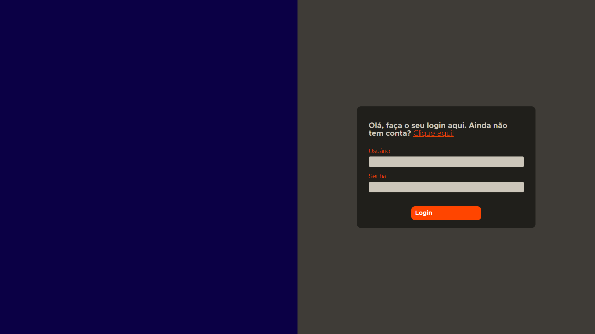
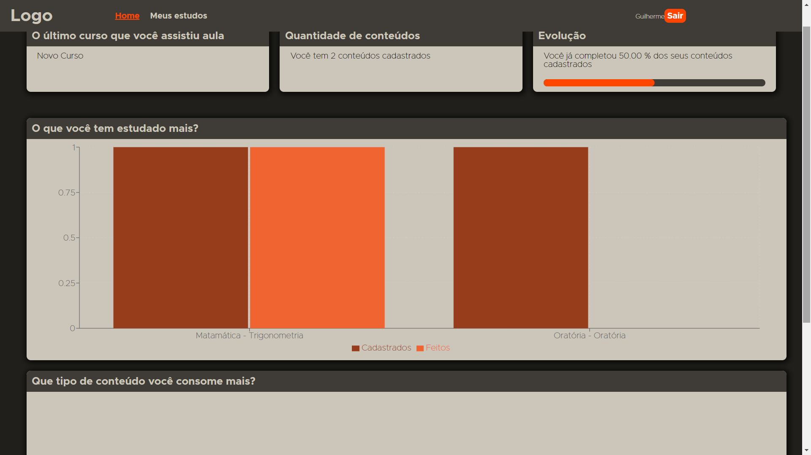
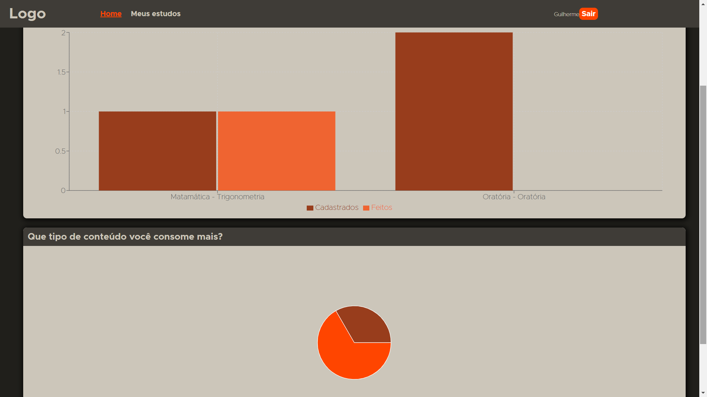
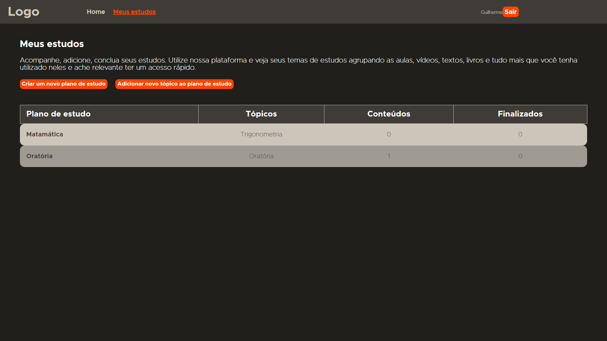
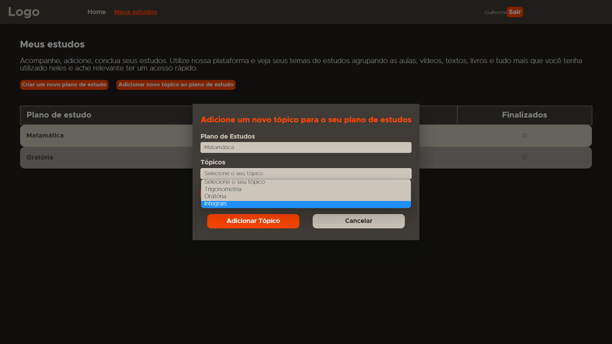
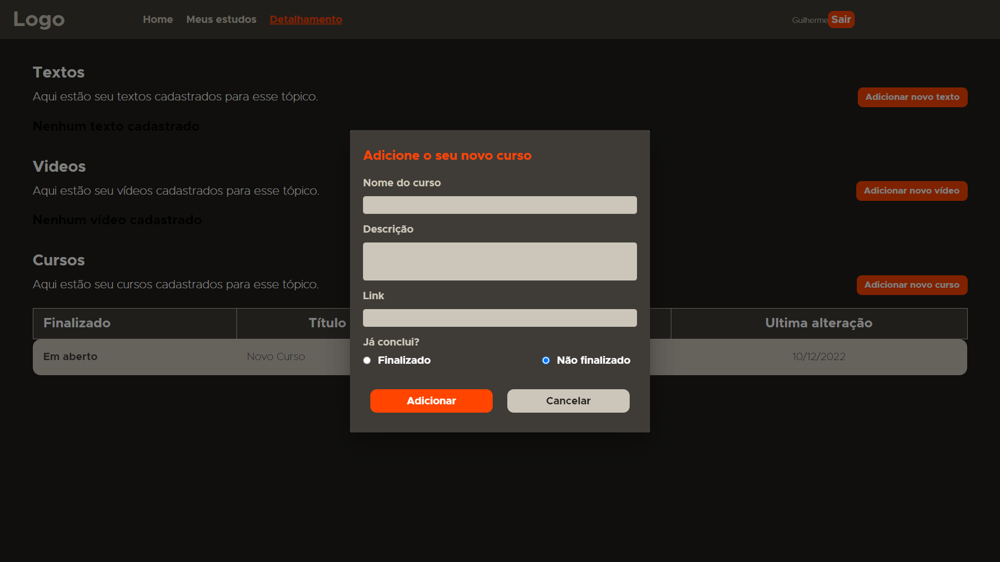
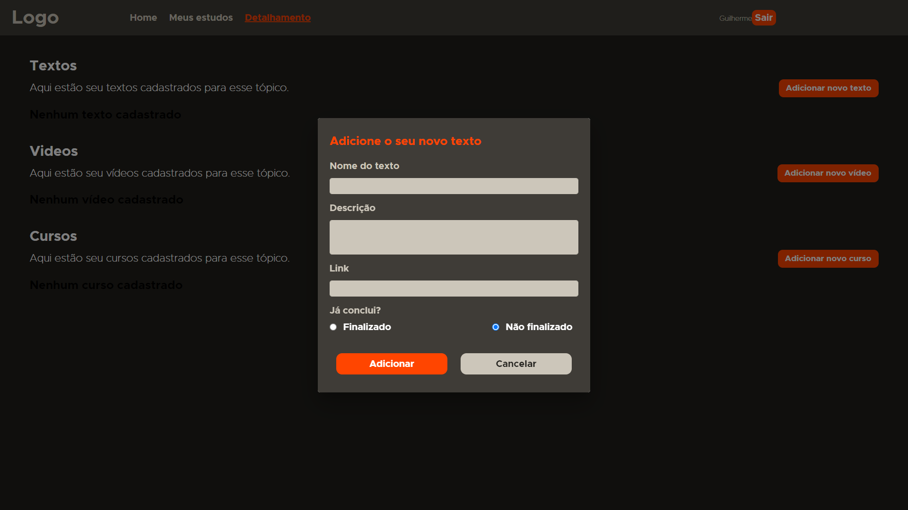
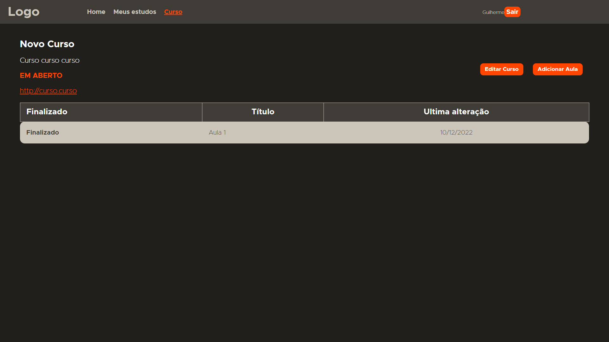
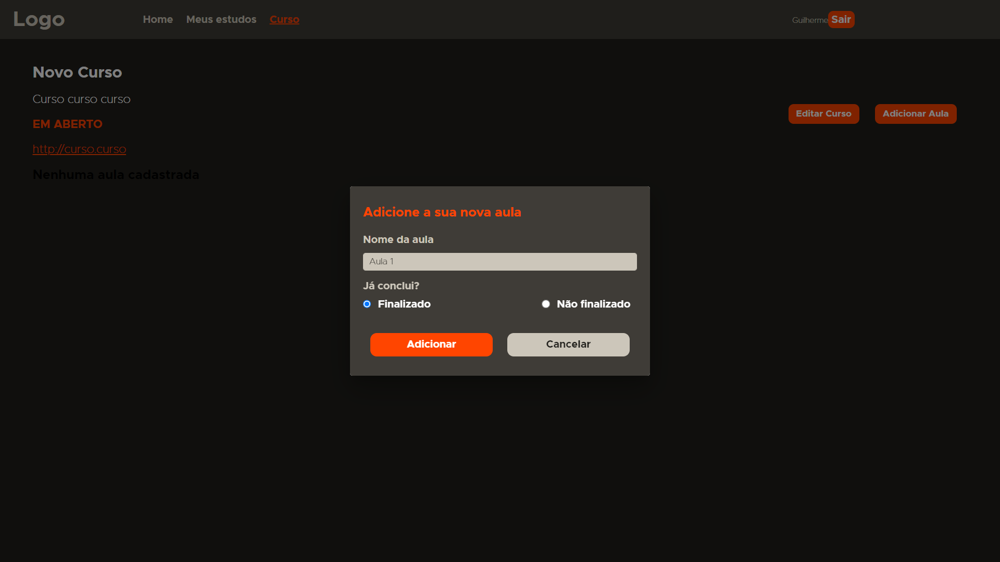

<h1 align="center"> :file_cabinet: Orange Notes </h1>

## :memo: Descrição

Esse projeto foi criado para o esquenta do programa de formação da FCamara, um desafio elaborado pela Orange Juice. Trata-se de uma plataforma para organização dos estudos, nela é possível armazer os link e separa-los por tópicos para cada plano de estudo que o usuário tenha, com essa plataforma o acesso para estudos passados é facilitado e uma analise básica sobre o andamento dos estudos, onde tem mais conteúdos e quais concluiu.

Essa plataforma está hospedada no vercel o Link do deploy para acesso é https://gui-notes.vercel.app/
Existe um usuário guivaz com senha 12345678 para teste caso deseje

O repositório de back end está no seguinte link https://github.com/Guivaz1993/note-back
A API está hospedada no Heroku com o link para acesso https://orange-note.onrender.com no mesmo site está hospedado o banco de dados para a utilização da api

## :books: Funcionalidades

- <b>Login</b>: Validação de usuário para entrar na plataforma, existem validações dos campos e link para a criação de um novo usuário em uma outra página

  

- <b>Acompanhamento</b>: Acompanhamento dos estudos.Gráficos para uma melhor visualização das informações, é possível navagar para o último curso assistido clicando na informação no topo da página e detalhamento dos gráficos passando o cursor sobre eles

  

  

  - <b>Meus Estudos</b>: Listagem dos tópicos de estudo. É possível criar novos tópicos de estudo nessa página usando algum dos pré cadastrados na plataforma ou cadastrar um novo plano de estudos ou novo tópico para poder utilizar futuramente

  

  

  - <b>Tela de estudo</b>: Listagem das informações do estudo agrupado em vídeos, textos e cursos. É possível navegar para o detalhamento de um deles clicando no desejado além de adicionar uma nova informação utilizando o botão da desejada

  

  

  - <b>Tela de Curso</b>: Listagem das aulas e detalhamento do curso. Cadastro e edição das aulas e informações do curso na página

  

  

## :wrench: Tecnologias utilizadas

- React.JS
- Material UI (Componentes previamente criados)
- Axios (Consumo da API)
- React-Router-Dom (Navegação entre as páginas)
- Recharts (Montagem de gráficos)
- Yup (Validações)

## :rocket: Rodando o projeto

Para rodar o repositório é necessário clonar o mesmo, dar o seguinte comando para iniciar o projeto:

```
<linha de comando>

cd ./orange-note

npm start
yarn start
```

## :soon: Implementação futura

Para uma próxima etapa estava planejado uma funcionalidade que ofereça opções de estudos de algum tópico usando o histórico de outros usuários.

## :handshake: Colaboradores

Guilherme Vaz

## :dart: Status do projeto

Finalizado
